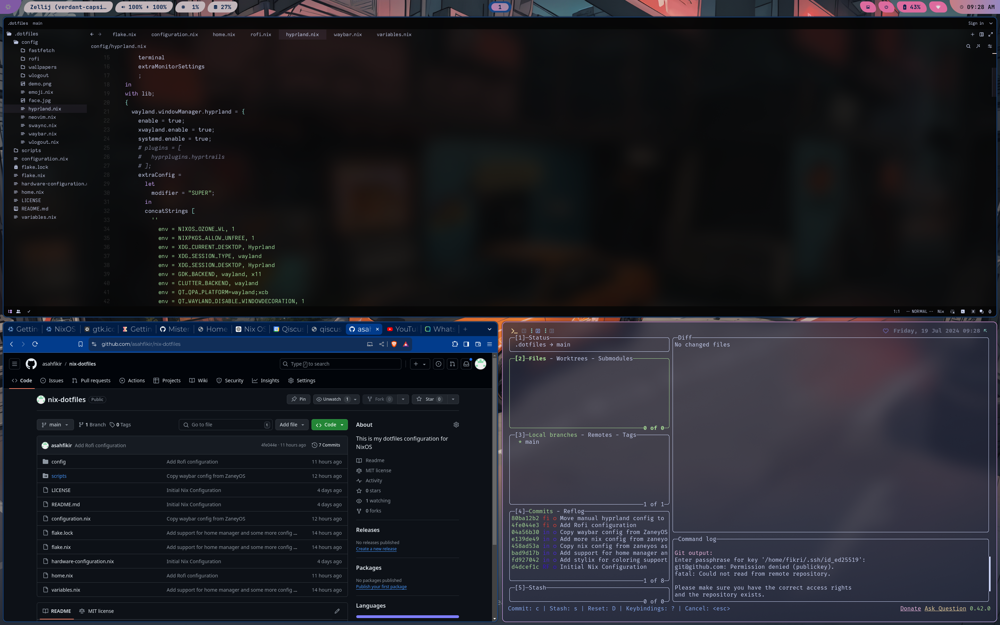

# nix-dotfiles
This is my dotfiles configuration for NixOS. This dotfiles
got some inspiration from
- [Misterio77](https://github.com/Misterio77/nix-starter-configs)
- [ZaneyOS](https://gitlab.com/Zaney/zaneyos)
Do checkout their work.

## What's inside?
### Browsers
- Brave (default)
- Firefox

### Editor
- Helix (default)
- zed-editor FIX: Copy paste not working in wayland
- vscode
- nvim TODO: Setup using NVCHad
- emacs TODO: Setup using doomemacs

### Terminal Goodies
- alacritty (default)
- tmux *TODO: Move to home manager
- zellij *TODO: Move to home manager
- fzf
- bat
- zoxide
- zsh

### Eye Candies
- Custom Wallpaper Switcher
- Hyprland
- Waybar
- Stylix

> This is a work in progress. I'll update from time to time

## Current State:

